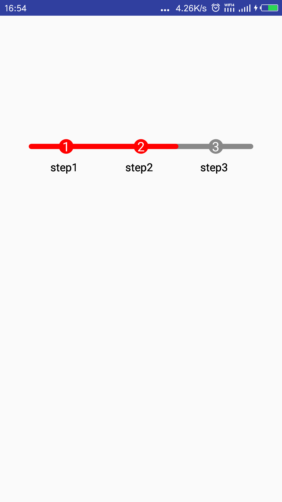

# Android Steps view



## Usage

```xml
<com.mrebollob.stepsview.StepsView
    android:id="@+id/small_steps_view"
    android:layout_width="match_parent"
    android:layout_height="wrap_content"
    app:thumb_size="50dp"/>
```

```java
final String[] steps = {"step1", "step2", "step3", "step4"};

stepsView.setLabels(steps)
        .setBarColorIndicator(Color.GRAY)
        .setProgressColorIndicator(Color.GREEN)
        .setLabelColorIndicator(Color.BLACK)
        .setCompletedPosition(2)
        .drawView();
```

**Source**
[Android-StepsView by anton46](https://github.com/anton46/Android-StepsView)
